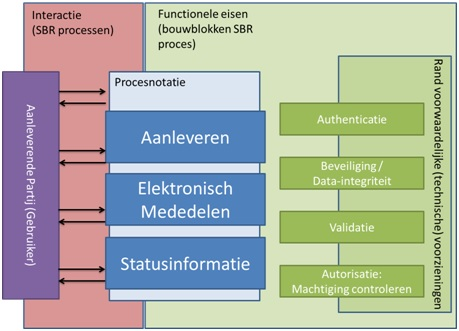

# Nederlande Proces Architectuur
Deze teksts is afkomstig van de vroegere SBR Wiki en valt onder het beheer van de Expertgroep Proces & Techniek.
# Context

SBR streeft naar standaardisatie van (financiële-)rapportage- en verantwoordingsstromen. Optimalisatie van deze rapportageketens vergt helderheid over de standaarden, processen en technieken die gebruikt kunnen worden. Dit is in het belang van de publieke en private afnemers, voor de partijen die rapportages aanleveren of ontvangen (ophalen) en voor alle andere betrokkenen in deze ketens.

Het SBR Afsprakenstelsel hanteert een tweetal architectuurproducten om deze standaardisatie te bevorderen: de Nederlandse Taxonomie Architectuur (NTA, elders beschreven) en de Nederlandse Proces Architectuur (NPA). De richtlijnen in de laatste geven marktpartijen en nieuwe/bestaande SBR partners handvatten om op gestandaardiseerde wijze de onderlinge digitale interactie met een SBR infrastructuur in te richten, en zo de kosten voor aansluiten op deze infrastructuur te beperken. Er zijn op dit moment twee implementaties van een dergelijke op de NPA gebaseerde SBR infrastructuur: de door Logius beheerde Digipoort, en de door banken opgezette BIV.

## Doel
De NPA heeft als doel het bieden van een overzicht van richtlijnen en generieke architectuurprincipes die handvatten bieden voor de standaardisatie van de system-to-system interactie met een SBR infrastructuur. Principes moeten toekomstvast zijn en onafhankelijk van de huidige implementatie opgesteld worden. Met de NPA wordt geborgd dat SBR implementaties aan generieke- en kwaliteitseisen voldoen: er wordt zo veel mogelijk één standaard gehanteerd richting marktpartijen (softwareontwikkelaars) waarbij de informatieprocessen op eenduidige wijze worden afgehandeld.

De SBR Governance schrijft voor dat zowel nieuwe als bestaande SBR partners zich – zowel bij gebruik van als bij implementatie van een SBR infrastructuur – zoveel mogelijk houden aan de NPA principes. SBR Partners kunnen van deze principes wel afwijken, mits deze afwijkingen duidelijk verantwoord en onderbouwd zijn. Zij streven echter naar een implementatie die zo dicht als mogelijk tegen de principes van de NPA aan ligt.

## Historie
De NPA is initieel opgesteld uit bijdragen van diverse organisaties, waaronder de Belastingdienst, CBS, de Kamer van Koophandel, SBR Banken en Logius. De NPA maakt onderdeel uit van het SBR afsprakenstelsel, en wordt door Logius (in kader van het ondersteunen van de governance) onderhouden.

## Definities
De in dit document gehanteerde begrippen worden in de onderstaande tabel gedefinieerd:

| Begrip  | Definitie |
|---------|-----------|
Afnemer | Een entiteit (overheid of bank) die voor de uitoefening van een publieke of private taak elektronisch verkeer met (andere) overheden, burgers en/of bedrijven wenselijk acht en daarbij gebruik maakt van SBR om elektronische berichten te ontvangen of versturen (mede te delen). (Afnemer wordt ook wel ‘uitvragende partij’ genoemd.)
Gebruiker | Een onderneming, rechtspersoon of natuurlijke persoon die gebruik maakt van SBR ten behoeve van het elektronische verkeer met één of meerdere Afnemers (ook wel aanleveraar, bedrijf of intermediair).
Belanghebbende | Een onderneming, rechtspersoon of natuurlijke persoon namens wie een gebruiker gebruik maakt van SBR. De aan te leveren of op te halen informatie heeft betrekking op deze entiteit. De belanghebbende kán dezelfde onderneming, rechtspersoon of natuurlijke persoon zijn als de eerdergenoemde gebruiker.
Certificaat | Een digitaal document dat gegevens bevat voor de waarborging van de integriteit van bestanden en/of opzetten van een beveiligde verbinding. Ook kan een certificaat worden gebruikt voor authenticatie, zowel op technisch niveau als ook op het niveau van een persoon of organisatie.
SBR infrastructuur | Een voorziening die geautomatiseerd keteninformatieprocessen uitvoert op basis van SBR gegevensstandaarden, processtandaarden en technische standaarden. Een SBR infrastructuur zorgt voor het gestandaardiseerd uitvoeren en beheren van informatie-uitwisselingsprocessen, en bestaat uit een digitale toegangspoort van bijvoorbeeld de overheid of Banken. De aanleverportalen (van SBR partners) maken geen deel uit van de SBR infrastructuur en vallen buiten scope van de NPA.
Koppelvlak | Een (system-to-system) verbinding tussen informatiesystemen die de uitwisseling van informatie faciliteert. Een koppelvlak definieert de interactie tussen de SBR infrastructuur en de gebruiker of de interactie tussen de SBR infrastructuur en een afnemer.
Proces | Een doelgericht samenhangend geheel van opeenvolgende activiteiten in de tijd.
SBR Partner | Een publieke of private partij die voldoet aan alle eisen/verplichtingen vanuit het SBR stelsel, en die derhalve voluit als zodanig binnen het stelsel participeert en onderdeel is van de publiek-private governancestructuur.

# Governance
De NPA is onderwerp van bespreking in de Werkgroep NPA, waarin deelnemers van de overheid (Werkgroep Processen & Techniek) en SBR Banken zijn vertegenwoordigd. In de regel worden wijzigingen besproken in de Werkgroep Processen & Techniek en vindt schriftelijke afstemming met SBR Banken plaats (dus een schriftelijke ‘bijeenkomst’ van de Werkgroep NPA).

Voor in-gebruik-name van een aanpassing van de NPA wordt de Expertgroep Processen en Techniek geïnformeerd en om advies gevraagd, waarna de aanpassing wordt bekrachtigd in het Platform en voorgelegd aan het SBR Beraad ter vaststelling.

Het SBR Beraad beslist, op voordracht van het Platform, over bekrachtiging van de NPA. Het Beraad vergewist zich ervan dat de brede SBR community, vertegenwoordigd in de Expertgroep P&T, in de gelegenheid is gesteld hierover te adviseren.

Logius beheert de NPA. Wijzigingsvoorstellen kunnen worden ingediend via de Expertgroep Processen & Techniek (vanuit marktpartijen) of bij de Werkgroep NPA (vanuit overheid en SBR Banken).

De Werkgroep NPA beoordeelt wenselijkheid, eventueel na afstemming met technische experts. Indien er een mogelijk grote impact bestaat kan een Request for Comments worden gepubliceerd (op website SBR-nl.nl) en verstuurd aan de deelnemers van de EG P&T. De Werkgroep NPA doet, na impact bepaling op implementatie, een voorstel over de voorgenomen aanpassing van NPA en implementatietermijn.

Het is mogelijk dat voorgenomen wijzigingen bredere impact hebben binnen Digipoort dan enkel op SBR. In die gevallen zal Logius het onderwerp ook in de Werkgroep Architectuur Digipoort voorleggen ter besluitvorming.

# Scope

Onderstaande punten en schema geven de scope aan van de NPA.

## Binnen Scope

Zoals de NTA over gegevens (harmonisatie) en XBRL (technische standaard) gaat, gaat de NPA over processen en het gebruik van en de eisen aan de onderliggende technische standaarden.

De NPA ziet toe op de interactie met de SBR infrastructuur. De verschillende interacties tussen gebruiker en verwerkende infrastructuur zijn gebundeld in een SBR proces. Ieder proces stelt functionele eisen aan de standaard ‘bouwblokken’ waaruit het proces bestaat.

Er wordt onderscheid gemaakt tussen ''functionele eisen'' en ''randvoorwaardelijke voorzieningen''.

'''Functionele eisen''' in de NPA zien, per bouwblok, op eenduidige terminologie, conventies en requirements ten aanzien van randvoorwaardelijke voorzieningen.

'''Randvoorwaardelijke voorzieningen''' (standaarden, technische aspecten en stelsels) die buiten de SBR Governance liggen worden in de NPA als zodanig benoemd. In de NPA wordt bepaald welke onderdelen van standaarden gebruikt worden in het kader van SBR.

De NPA is gebaseerd op de huidige SBR architectuurprincipes zoals geïmplementeerd in Digipoort en BIV.

SBR processen en SBR bouwblokken die door één partij zijn ontwikkeld en geïmplementeerd vormen de facto de huidige standaard en zijn opgenomen in de NPA om standaardisatie te bevorderen. Bij in gebruik name van deze processen of bouwblokken door andere SBR partners zullen de principes en richtlijnen, zoals geformuleerd in dit document, als leidraad gelden. Afwijkende wensen en use-cases zullen in de Werkgroep NPA besproken worden en kunnen leiden tot een aanpassing van de NPA.

SBR Partners streven naar standaardisatie, maar domein-specifieke invulling door de afnemers (SBR Partners) is mogelijk. Zij blijven zelf beslissingsbevoegd over voorschriften uit de NPA, maar moeten verantwoording in Expertgroep en Platform afleggen over hun keuzes.

Het koppelvlak dient te voldoen aan actuele standaarden op het gebied van cybersecurity (bijvoorbeeld gecontroleerd op virussen, geen phishing content).

## Buiten scope

Procesafwikkeling en berichtverwerking volgend op interactie met de gebruiker valt buiten de scope van de NPA. Dit ziet zowel op interne berichtafhandeling binnen een SBR infrastructuur als berichtafhandeling door een afnemer.

De aanleverportalen (van SBR Partners) maken geen deel uit van de SBR infrastructuur en vallen buiten scope van de NPA.

Aspecten van een SBR service organisatie zoals bijvoorbeeld aansluitondersteuning, klantondersteuning, machtingsprocessen (B2), het verzorgen van een ingerichte beheerorganisatie, interactie tussen SBR infrastructuur en afnemer (bijvoorbeeld Digipoort – Belastingdienst) en afspraken rond service niveaus (openstellingstijden, verwerkingscapaciteit, betrouwbaarheid, etc.) vallen buiten de scope van de NPA.

De NPA is geen "SBR Roadmap": er wordt geen toekomst visie / roadmap voor de komende jaren geschetst. Er wordt wel rekening gehouden met ontwikkelingen in de nabije toekomst.

# NPA: Processen
De gebruiker (aanleverende partij) communiceert met de SBR infrastructuur door interacties met een SBR proces. Ieder proces (aanleveren, eMededelen en statusinformatie) maakt gebruik van een aantal bouwblokken, die in het volgende hoofdstuk worden weergegeven.

## Aanleveren (Generiek)
Aanleveren bestaat uit het door de gebruiker versturen van een bericht naar een SBR infrastructuur en het ontvangen van het resultaat van de verwerking.

### Interactie
Het verloop van de aanleverinteractie is als volgt: Indien de technische verwerking van een aanleververzoek (request) in de aanleverservice succesvol verlopen is, wordt er een response verzonden. De response maakt melding van het ‘kenmerk’ van het proces. Dit kenmerk moet worden gebruikt om de status van verwerking te bekijken met de statusinformatieservice.

Voor procesimplementaties gelden onderstaande generieke interactieprincipes:

* Iedere aanlevering is voorzien van een (conform het afgesproken koppelvlak) gestandaardiseerde set gegevens om het bericht op de juiste wijze te verwerken.
* Indien de technische verwerking van een verzoek (request) niet succesvol verlopen is, wordt er een foutbericht verzonden.
* Het foutbericht bevat een gedetailleerde beschrijving van de fout en een code waarmee in documentatie toelichting van de fout is te achterhalen.
* Het foutbericht is op eenduidige wijze opgesteld: syntax (gedefinieerde velden voor foutbericht) en semantiek (standaard wijze van fout(code) opmaak) zijn gestandaardiseerd.

Pas wanneer alle controles hebben uitgewezen dat berichten in orde zijn, levert de SBR infrastructuur deze af bij de afnemer.

## Aanleveren (met Assurance)

Aanleveren met assurance bestaat uit het door de gebruiker versturen van een bericht (of meerdere berichten) naar de SBR infrastructuur met daarbij een verantwoordingsverklaring (Assurance document).

### Interactie
Er is op hoofdlijnen dezelfde interactie als bij de Aanleveren generiek.

De verschillen zijn: De gebruiker verstuurt bij de berichten een bijbehorende verantwoordingsverklaring met de elektronische handtekening. De SBR infrastructuur controleert (naast de berichten) ook de bijbehorende elektronische handtekening en controleert tevens het doel en de juridische achtergrond van de handtekening (in voorkomende gevallen of de juiste soort handtekening is gezet).

Het afleveren door de SBR infrastructuur aan de afnemer gebeurd pas nadat ook gecontroleerd is dat de verantwoordingsverklaring in orde is.

## eMededelen

eMededelen bestaat uit het ophalen van een bericht door een (gemachtigde) gebruiker uit een SBR infrastructuur en verifiëren of diegene die het bericht ophaalt gerechtigd is dit te doen. Afhankelijk van de berichtsoort bestaan de volgende methoden om een bericht beschikbaar te stellen aan een gebruiker:

* Een bericht wordt rechtstreeks aan de gebruiker geadresseerd op basis van één van diens identificerende gegevens, zoals een KvK-nummer of RSIN. De gebruiker heeft in dat geval een certificaat nodig met daarin het betreffende identificerende gegeven om het bericht op te kunnen halen.

* Een bericht wordt beschikbaar gesteld aan de gebruiker op basis van een machtigingsregistratie. Een machtigingsregistratie beschrijft de relatie tussen de partij die een bericht mag ophalen (de gebruiker oftewel gemachtigde) en de belanghebbende. De gebruiker heeft een certificaat nodig met daarin het identificerende gegeven dat binnen de machtigingsregistratie als gemachtigde wordt genoemd.

* Een combinatie van bovenstaande methoden. Een bericht kan dan zowel rechtstreeks door de eigenaar van het betreffende identificerende gegeven worden opgehaald, als door een andere marktpartij op basis van een machtigingsrelatie tussen beide partijen.

### Interactie
Hierbij gelden onderstaande generieke interactie principes:

* Voordat een bericht wordt opgehaald moet worden vastgesteld welke berichten opgehaald kunnen worden. Er wordt een lijst met klaarstaande berichten opgevraagd (totale lijst, of overzicht van mutaties sinds de vorige lijst) en daarna worden de individuele berichten opgehaald aan de hand van een uniek identificerend kenmerk.

* Ieder verzoek om een bericht op te halen is voorzien van gegevens om het op te vragen bericht te identificeren.

* Ieder verzoek om een bericht op te halen door een gebruiker (hetzij een gemachtigde, hetzij de belanghebbende zelf) wordt getekend met een certificaat waarin identificerende gegevens van deze gebruiker zijn opgenomen.

* Indien de technische verwerking van een verzoek (request) succesvol verlopen is, wordt er een response verzonden. De response bevat het op te halen bericht.

* Indien de technische verwerking van een verzoek (request) niet succesvol verlopen is, wordt er een foutbericht verzonden. Het foutbericht bevat een gedetailleerde beschrijving van de fout en een code waarmee in documentatie toelichting op de fout is te achterhalen.

## Statusinformatie

De gebruiker dient op eenduidige wijze statusinformatie te kunnen inzien met betrekking tot de aangeleverde berichten. De statusinformatieservice is een dienst _(1)_ waarbij gebruikers informatie kunnen opvragen met betrekking tot het verwerkingsproces van een door hen zelf aangeleverd bericht. Er dient gecontroleerd te worden of een gebruiker gerechtigd is de statusinformatie in te zien.

_1. Er zijn verschillende wijzen waarop de statusinformatie kan worden overgedragen, de ‘dienst’ kan ingevuld worden via webservices (WUS: WSDL+UDDI+SOAP), via ebMS of bijvoorbeeld (zoals bij het grote berichtenkanaal wel wordt gebruikt) via FTP(S). In deze NPA wordt niet zozeer ingegaan op de specifieke koppelvlakken waarmee de statusinformatie wordt gedeeld, maar ligt meer de nadruk op wat het (functionele) gedrag van statusinformatie moet zijn._

### Interactie
Indien een afnemer na ontvangst van een bericht, eigen controles toepast op de berichtinhoud alvorens het bericht te accepteren voor inhoudelijke behandeling, dient de statusinformatie uit dit proces beschikbaar te worden gesteld via dezelfde service als de statusinformatie uit de SBR infrastructuur.

Hiertoe dient een tussen afnemers gestandaardiseerde syntax (gedefinieerde velden voor statusbericht) en semantiek (standaard wijze van status(code) opmaak) te worden gebruikt.

In documentatie dient aangegeven te worden welke statuscodes een verwachte eindstatus betreffen en wat de juridische betekenis is van een bepaalde status. De documentatie en juridische betekenis kan per SBR Partner verschillen.

De statusinformatie met betrekking tot aangeleverde berichten, kan op verschillende manieren worden opgevraagd:

a) Door het opgeven van een specifiek ‘kenmerk’, zoals ontvangen in de respons bij het aanleveren van het betreffende bericht, geeft de statusinformatieservice de statusinformatie met betrekking tot dit specifieke bericht terug.

b) Optioneel kan door het opgeven van een ‘berichtsoort’ en eventueel een periode, een lijst met kenmerken van berichten opgevraagd worden, die onder een bepaalde berichtsoort zijn aangeleverd. Aan de hand van de ontvangen kenmerken kan vervolgens de statusinformatie, behorende bij de betreffende gegevens, worden opgevraagd volgens de methode onder a).

# NPA: Bouwblokken
Zoals in de scope is aangegeven wordt ieder SBR proces opgebouwd op basis van bouwblokken. Er wordt onderscheid gemaakt tussen functionele eisen en randvoorwaardelijke voorzieningen die gebruikt worden in de SBR infrastructuur om aan de functionele eisen te voldoen.

## Algemeen, niet-bouwblok specifiek
### Niet-Functionele eisen
Alle wijzigingen in een SBR infrastructuur worden op die wijze aangebracht dat het voor aangesloten partijen mogelijk blijft de bestaande functionaliteit een reële periode te blijven gebruiken alvorens over te gaan op gewijzigde functionaliteit.

Iedere wijziging zal, waar mogelijk, worden ingeleid door een overgangsperiode, die na consultatie in de markt (expertgroep) is vastgesteld, om partijen de tijd te geven nieuwe functionaliteit te implementeren. Tijdens de overgangsperiode wordt de oude functionaliteit ondersteund.

### Functionele eisen

SBR informatie stromen worden system-2-system afgehandeld.

N:1:N: De SBR infrastructuur kent zowel aan aanlever- als afleverkant meerdere koppelingen met ketenpartners.

1:1:1: Ieder bericht wordt vanuit 1 partij naar 1 partij verzonden. Berichten worden niet opgesplitst, samengevoegd of naar meerdere partijen verzonden _(2)_.

Berichtverwerking is ‘transactiegewijs’ (in tegenstelling tot batchgewijs). Ieder bericht betreft één transactie en is zodanig te herkennen.
Het endpoint waarop wordt aangesproken kan zowel generiek (voor meerdere berichtsoorten) als specifiek (per berichtsoort / operatie) worden ingezet.

_2 De Digipoort – als één van de implementaties van de SBR infrastructuur – kent overigens ten tijde van dit schrijven wel degelijk stromen waarbij één bericht aan meerdere partijen wordt verzonden, namelijk in het domein Handel en Transport (Logistiek). Het betreft hier een domein met andere governance, dat niet onderdeel is van het SBR domein is en ook niet onder het NPA regime valt._

### Randvoorwaardelijke voorzieningen
SBR implementaties door overheidspartijen gebruiken door Digikoppeling voorgeschreven koppelvlakstandaarden, waaronder WUS, ebMS en een grote berichtenkanaal.

SBR implementaties door private partijen gebruiken op Digikoppeling gebaseerde koppelvlak standaarden om een zo groot mogelijke eenduidigheid naar de markt te creëren.

## Bouwblok specifiek: Authenticatie
### Functionele eisen
De authenticiteit van systemen in de SBR infrastructuur en van de gebruikers van een service moet door alle deelnemende partijen vastgesteld kunnen worden voordat een datacommunicatiesessie (transportniveau) wordt gestart. Afhankelijk van de stroom kan er sprake zijn van controle tegenover een blacklist (voor uitsluitingen) of een whitelist.

### Randvoorwaardelijke voorzieningen
De verbinding tussen de client en de SBR infrastructuur dient volgens het TLS-protocol met een certificaat opgezet te worden. De authenticiteit dient te worden gecontroleerd met behulp van PKIoverheidscertificaten (X.509).

De geldigheid van het client-certificaat dient aan de hand van de gegevens in het certificaat gecontroleerd te worden. Er dient gecontroleerd te worden _(3)_ of het certificaat niet is ingetrokken.

_3 De meest gebruikelijke manier om dit te doen is met behulp van een Certificate Revocation List (CRL)._

### Gebruik bouwblok in processen
Het bouwblok Authenticatie wordt gebruikt in de volgende processen:

Aanleveren generiek (verplicht), aanleveren assurance (verplicht), eMededelen (verplicht) en Statusinformatie (verplicht).

## Bouwblok-specifiek: Autorisatie (inclusief controleren machtiging)
### Functionele eisen
De eisen rondom het autorisatie/controleren machtiging zijn voor de verschillende processen hieronder uitgewerkt.
#### Functionele eisen: Statusinformatie
De statusinformatie service controleert of de gebruiker voor elke status of kenmerk geautoriseerd is. Een gebruiker is geautoriseerd als het statusinformatieverzoek wordt ondertekend (signing) met een PKIoverheidscertificaat met daarin opgenomen hetzelfde identificerende gegeven als het PKIoverheidscertificaat waarmee het oorspronkelijke bericht is ondertekend (signing). Er mogen verschillende certificaten gebruikt worden, als het identificerende gegeven maar gelijk is.

Indien het oorspronkelijke bericht wordt aangeleverd zonder signing, dan wordt het identificerende gegeven van het PKIoverheidscertificaat waarmee het statusinformatieverzoek wordt gedaan vergeleken met het identificerende gegeven van het PKIoverheidscertificaat waarmee het transport van de oorspronkelijke aanlevering is gedaan.

#### Functionele eisen: eMededelen
De relatie tussen de partij die een bericht ophaalt (Gebruiker) en de belanghebbende, in combinatie met de dienst waarop het betrekking heeft, kan expliciet zijn vastgelegd in een machtigingregister. Bij het ophalen van een bericht worden in dat geval controles uitgevoerd ter autorisatie van de handeling:

* Het identificerende gegeven in het certificaat waarmee het bericht wordt opgehaald (bijvoorbeeld een KvK-nummer of RSIN) moet identiek zijn aan het identificerende gegeven van de gemachtigde dat is vastgelegd in het machtigingenregister.

* Naast de controle of de partij die het bericht ophaalt ook gemachtigd is, wordt ook gecontroleerd of deze machtiging geldt voor relevante dienst/berichtsoort die voor het bericht van toepassing is.

### Randvoorwaardelijke voorzieningen
Bij Mededelen geldt dat alle machtigingen ten behoeve van het ophalen van mededelingen dienen te worden geregistreerd in het B2 machtigingenregister.

### Gebruik bouwblok in processen
Het bouwblok Autorisatie wordt gebruikt in de volgende processen:

eMededelen (verplicht) en Statusinformatie (verplicht).

## Bouwblok-specifiek: Beveiliging
### Functionele eisen
Op berichtniveau moet de integriteit van het bericht zelf vastgesteld kunnen worden (bericht is ongewijzigd tijdens transport). Hiertoe dienen aangeleverde berichten te worden ondertekend met een certificaat dat voldoet aan de informatie beveiligingseisen voor het desbetreffende bericht. Binnen SBR is ervoor gekozen_(4)_ dit te borgen door het certificaat altijd een PKIoverheidscertificaat te laten zijn. De ondertekening bestaat_(5)_ uit de met het certificaat versleutelde digest (hash van het bericht).

_4 Deze keuze volgt uit het adopteren van de Digikoppeling standaard._

_5 De invulling van deze eis is het hanteren van de minimumeis “Digikoppelingsprofiel met signing”._

### Randvoorwaardelijke voorzieningen
Zowel het aanleverbericht (request) als het retourbericht (respons) wordt ondertekend (met behulp van PKIoverheidscertificaten met de WS-Security).

Waar er sprake is van SOAP body- en header-elementen geldt dat het bericht beveiligd dient te zijn met een handtekening over deze elementen (die door de koppelvlakspecificaties zijn vereist), volgens het WS-Security protocol. Bij het grote berichtenkanaal is geen WS-Security van toepassing.

### Gebruik bouwblok in processen
Het bouwblok Beveiligen wordt gebruikt in de volgende processen:

Aanleveren generiek (verplicht), aanleveren assurance (verplicht), eMededelen (verplicht) en Statusinformatie (verplicht).

## Bouwblok-specifiek: Validatie

Door de SBR infrastructuur worden verschillende validaties uitgevoerd. Verschillende vormen van validatie die kunnen worden uitgevoerd:

- XML validatie: is het bericht valide XML?

- XML schemavalidatie: voldoet het bericht aan een XSD (XML Schema Definiton, versie 1.0)

- XBRL validaties: voldoet het XBRL bericht aan de taxonomie, aan relevante filing rules en/of aan andere XBRL validaties? (De service van de SBR infrastructuur controleert o.a. of met het aangeleverde XBRL instance voldaan wordt aan de structuurregels zoals afgesproken voor het betreffende domein)

- Validaties rondom Preparer Extensions. Een Preparer Extension is een uitbreiding op het document dat door middel van SBR wordt verzonden, waarbij organisatie- of branchespecifieke taxonomiedefinities worden toegevoegd aan de reguliere taxonomie voor de XBRL instance. De SBR infrastructuur valideert de Taxonomie van de bijlage Preparer Extensions samen met de geldende taxonomie door de bijbehorende schema’s en linkbases te toetsen ten opzichte van de geldende XBRL specificaties.

Een voorbeeld van een andersoortige controle die wordt toegepast: is de omvang van het bericht beperkt tot de afgesproken grootte?

Voor assurance is er nog validatie rondom de technische correctheid en inhoudelijke geschiktheid van de gebruikte handtekening bij de verantwoordingsverklaring.

### Algemene functionele eisen (aanleveren generiek, aanleveren met assurance)
Ieder aangeleverd bericht (inhoud) door een gebruiker wordt gevalideerd door de SBR infrastructuur om de kwaliteit van het ingestuurde bericht te toetsen en de gebruiker direct terugkoppeling te geven over de verwerkbaarheid van het bericht. Validatie kan o.a. plaatsvinden op basis van de voorgeschreven taxonomie.

### Functionele eisen Aanleveren assurance
De elektronische handtekening wordt gecontroleerd op consistentie en validiteit, waaronder het refereren naar de actuele versie van de SBR signature policy, en het aangeven van de commitment type voor de referentie naar de verantwoordingsverklaring.

### Functionele eisen Preparer Extensions
Preparer Extensions is een (optionele) aanvulling voor aanleveringen voor zowel stromen Aanleveren (Generiek) en Aanleveren (Assurance).

Een instance met Preparer Extensions moet gevalideerd kunnen worden tegen de eisen zoals gesteld door de Taskforce Preparer Extensions. Hiervoor is zowel een Whitepaper als een Greenpaper opgesteld.

### Randvoorwaardelijke voorzieningen –aanleveren assurance

In het bericht dient te worden aangeleverd :

* precies één Instance Document ten behoeve van de facts (een *.xbrl bestand)

* precies één Instance Document ten behoeve van assurance (een *.xbrl bestand)

* precies één XML Handtekeningbestand (een *.xml bestand)

In de XML signature file is één handtekening opgenomen op basis van de Advanced Electronic Signature (XAdES) specificatie;

In de handtekening komen drie verschillende referenties voor:

* De eerste referentie omvat een verwijzing naar en een digest van assurancebestand;

* De tweede referentie omvat een verwijzing naar en een digest van de XBRL facts-instance;

* De derde referentie omvat een verwijzing naar en een digest van de signed properties van de handtekening.

Identiteiten die dienen te worden uitgesloten van het leveren van assurance-bijlagen moeten zijn opgenomen in een actuele blacklist.

Per berichtsoort moet duidelijk zijn wat de juridische betekenis is van de ondertekening d.m.v. de Assurance bijlage.

### Randvoorwaardelijke voorzieningen Aanleveren generiek en Aanleveren Assurance – preparer extensions
Preparer extensions is een optionele aanvulling op aanleveringen voor de processen Aanleveren generiek en Aanleveren Assurance.

Voor het gebruik van Preparer Extensions dienen bij het bericht bijlagen te worden gevoegd voor zowel het schema van het entrypoint van de XBRL extensie (*.xsd), voor het schema van de XBRL extensie taxonomie (*.xsd) als voor de verschillende XBRL linkbases (formula linkbase, reference linkbase etc. etc.) (allen *.xml)

### Gebruik bouwblok in processen
Het bouwblok Validatie wordt gebruikt in alle processen. Per proces wordt hieronder aangegeven welke varianten in welk proces van toepassing zijn:

Proces | Vormen van validatie
|------|-----------------------|
Aanleveren generiek | XML validatie (verplicht)   XML schema validatie (verplicht)   XBRL validatie (optioneel)    Validaties rondom Preparer Extensions (optioneel)   Validatie omvang bericht (optioneel)
Aanleveren assurance | XML validatie (verplicht)   XML schema validatie (verplicht)   XBRL validatie (optioneel)   Validaties rondom Preparer Extensions (optioneel)   Validatie omvang bericht (optioneel)
eMededelen | XML validatie (verplicht)
Statusinformatie | XML validatie (verplicht)    XML schema validatie (verplicht)

