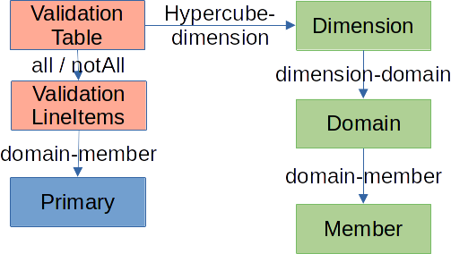

# Dimensionale opbouw binnen de Nederlandse Taxonomie
Bij het uitvragen van gegevens is het belangrijk te beschrijven in welke context een feit wordt gerapporteerd. Hierbij spelen dimensies een centrale rol. Het stelt de taxonomie auteur in staat om categorieën of classificaties te beschrijven waarmee duiding aan feiten wordt gegeven.

## Functionele indeling
In de Nederlandse Taxonomie bestaat dit uit 3 deels overlappende delen:

1. De lijst met te rapporteren feiten (primaries)
2. De indeling van de hypercube (validationTable en ValidationLineItems)
3. De dimensionale hierarchie (Dimensions, Domains en Members).

In de onderstaande illustratie geeft een voorbeeld van een dimensionale hiërarchie.

Hieronder zijn de twee varianten die in de NT worden gebruikt, afgebeeld. Hierin zijn deze onderdelen door middel van kleuren te onderscheiden. 

Links staan de te rapporteren items (Primaries in XBRL jargon). Deze worden per overzicht gekoppeld aan de ValidationLineItems. Dat laatste concept maakt samen met de ValidationTable de koppeling naar de dimensionale beschrijving zelf. Hiermee wordt de classificatie aangebracht. Een Dimensie bevat Domeinen, die op zijn beurt weer uit Members bestaat.

De BD taxonomieën en de oude OCW taxonomie (NT15 en ouder) maken gebruik van een explicite opbouw:

De nieuwe OCW taxonomie (vanaf NT16) en de KVK taxonomie maken gebruik van een impliciete benadering. Hierbij worden Domains en Members samengevoegd tot DomainMembers. Hierdoor is het mogelijk om diepe hiërarchieën te modelleren.

## Bestandsindeling
In de Nederlandse Taxonomie Architectuur zijn ook afspraken gemaakt over de naamgeving van bestanden. Voor de dimensionale opbouw zijn de volgende overzichten van belang. 

Als eerste de elementen zelf. Deze zijn in vier verschillende bestanden te vinden. Deze hoeven slechte per taxonomie te worden beschreven en worden vervolgens hergebruikt.

Elementen zijn verbonden via Arcs. Per onderdeel van de rapportage wordt hier een bestand voor gebruikt.

## Technische beschrijving bestandsnamen

### NT-breed
**2013/xbrl/sbr-dimensional-concepts.xsd**

Technisch hypercube abstract concept, ValidationTable, voor elke kubus, met @substitutionGroup xbrldt:hyperCubeItem.

EN Technisch primary abstract concept, ValidationLineItems, voor de primary concepten die altijd samen vanuit een kubus aangesproken zullen gaan worden, met @substitutionGroup sbr:primaryDomainItem. De concepten worden hergebruikt voor iedere kubus, waarbij de opbouw van de kubus en de primaries die aan de kubus gekoppeld zijn bepaald worden door de overige relaties in specifieke linkroles. 

### Per domein
**ntxx/{do}/eejjmmdd/dictionary/{do}-data.xsd**

De primary concepten die vanuit een kubus aangesproken zullen worden, met @substitutionGroup xbri:item. Deze kunnen indien nodig in verschillende sets worden opgenomen. 

**ntxx/{do}/eejjmmdd/dictionary/{do}-axes.xsd**

Schema met daarin de dimensie abstracte concepten voor de assen van de kubussen met @substitutionGroup xbrldt:dimensionItem.

**ntxx/{do}/eejjmmdd/dictionary/{do}-domains.xsd**

Technisch domein abstract concept voor 'landen met BTW verdrag' met @substitutionGroup sbr:domainItem. Indien meerdere domeinen nodig zijn wordt een concept opgenomen voor elk domein EN Abstracte concepten voor de domeinleden met @substitutionGroup sbr:DomainMemberItem. 

**ntxx/{do}/eejjmmdd/validation/{do}-linkroles-tables.xml**

Schema dat ELR's aanmaakt waarin de ValidationTabel aan de ValidationLineItems gekoppeld wordt. Elke kubus heeft een eigen ELR die de inhoud van de kubus bepaalt, waardoor de concepten ValidationTable en ValidationLineItems hergebruikt kunnen worden. 

**ntxx/{do}/eejjmmdd/validation/{do}-linkroles-axes.xsd**

Schema dat ELR's aanmaakt waarin de Dimensie/as aan het domein gekoppeld wordt 

## Per ELR

**ntxx/{do}/eejjmmdd/validation/{do}-{lr}-lineitems-def.xml**

Linkbase per entrypoint(<ep>) met daarin de relaties tussen het ValidationLineItems concept en de primaries in de ELR die gekoppeld zijn aan de kubus die in die ELR aan ValidationLineItems gekoppeld is. Meerdere ELR's mogen in deze linkbase worden opgenomen). 

**ntxx/{do}/eejjmmdd/validation/{do}-{lr}-def.xml**

D-linkbase(s)per entrypoint(<ep>)waarin de ValidationTable naar de dimension gekoppeld wordt EN De ValidationLineItems aan de ValidationTable met de 'all' arc. De inhoud van de kubus wordt bepaald door de targetRole met een linkrole uit {do}-linkroles-axes.xsd.

Welke primaries aan de kubus gekoppeld worden wordt bepaald door de linkrole uit {do}-linkroles-tables.xsd. 

## Ad: Hergebruik van hypercube
Binnen de NT wordt er 1 hypercube eenmalig aangemaakt. Deze wordt vervolgens hergebruikt per onderdeel in de rapportage. Dit is waarom het 'ValidationLineItems' en 'ValidationTable' concept in de taxonomie zit. In andere taxonomieën komt het vaak voor dat er per dimensionale structuur een nieuwe hypercube wordt gebouwd.

De XBRL specificatie staat complexe samenstelling van hypercubes toe, zo is het ook mogelijk om filters toe te passen door het toepassen van de zogenaamde 'notAll' arc tussen de hypercube en een Dimensie. In de Nederlandse Taxonomie zijn deze handeling echter niet toegestaan.

## Ad: externe documentatie
Guidance vanuit XBRL International:

[Dimensions technical FAQ ](https://www.xbrl.org/guidance/technical-dimensions-faq/)

Relevante specificaties:

[XBRL Dimensions 1.0](https://specifications.xbrl.org/work-product-index-group-dimensions-dimensions.html)
